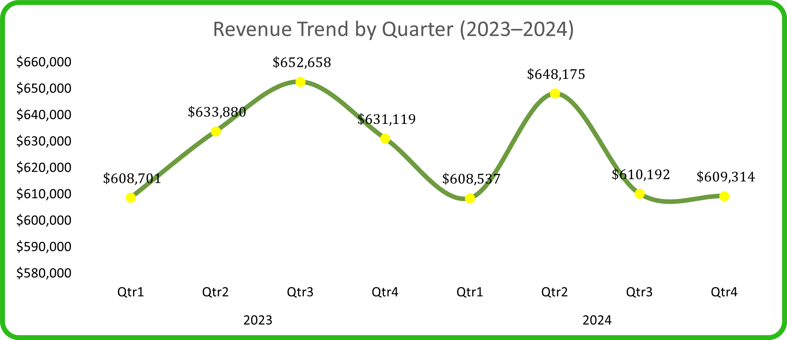
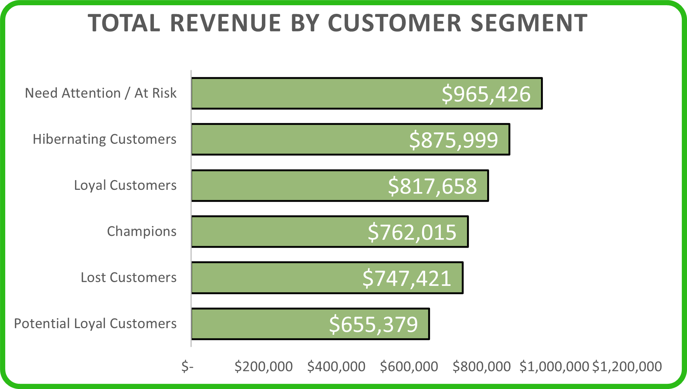
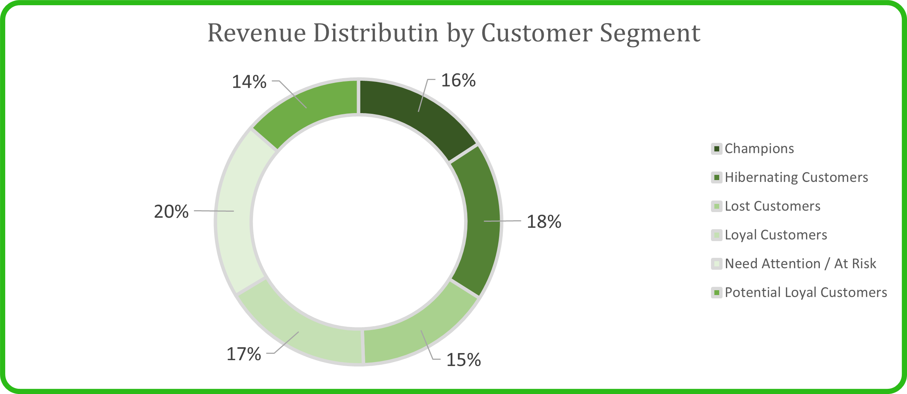

## Customer Segmentation with RFM Analysis and Retention Analysis (2023-2024)

<h2 align='Center' style="font-weight:bold; font-family:consolas">Project Overview</h2>

This project provides actionable business insights by combining <b>Cohort Retention Analysis</b> and <b>RFM Customer Segmentation</b> to understand both when customers churn and which customers are worth retaining.

This dataset cover retail fashion transactions from 2021-2024, but this analysis focuses on <b>2023-2024</b> to reflect current business conditions and provide relevant strategic recommendations

**Found the original dataset here**:
[Original Dataset](https://www.kaggle.com/datasets/vanpatangan/retail-fashion-data)

---

#### Business Question :

How is customer retention performing, and which customer segments will contribute the most to revenue throughout the 2023-2024 period ?

To answer this comprehensively, we need to understande:
<ol>
   <li>When do customers leave ?</li>
   <li>Who are our most valuable customers</li>
   <li>Where should we focus retention efforts</li>
</ol>

---

<h2 style="font-family:consolas; font-size:1.2rem; font-weigh:bold">
Part one: Cohort Retention Analysis - to understanding WHEN Customer Churn
</h2>

**Key Findings**

1. **Extreme First-Month Chutn Across All Cohorts**
   - **95%** churn rate occurs immediately after the first purchase across nearly all cohorts from 2023-2024.
   - January 2023 cohort: 265 customers acquired, but only **3.4% returned** in month 2 (256 customers lost immediately).
   - This pattern is consistent regardless of acquisition period, indicating a **systematic retention problem rather than seasonal issues**.
2. **Acquisition Trends and Peak Performance Windows**
   **High performing acquisition periods:**
   - April 2023: **5.8%** retention in month 2 (highest in 2023)
   - November 2024 :**5.6%** retention in month 2 (highest in 2024)
   - Q4 months (Oct-Dec) consistenly show **~5% retention**, suggesting year-end campaigns have slightly better effectivenes
     **Declining acquisition volume:**
   - January 2023 : 265 new customers.
   - December 2024 : only **1 new customers**
   - Consistent downward trend throughout 2023-2024, indicating weakening acquisition channels
3. **Critical Low Points - Operationa Red Flags**
   **Worst Performing Cohorts:**
   - May 2024 : **0.75%/0.8%** retention (lowest in dataset)
   - August 2024 : **0.67%** retention
   - These Q2-Q3 2024 dips suggest potential operational issues, product quality problems, or market saturation during mid-year
4. **Quarterly Behavior Patterns**
   - **Q1 (Jan-Mar)** : Moderate acquisition, weak retention (~3-4%).
   - **Q2-Q3 (Apr-Sep)** : Highly variable, with both peaks (Apr 2023) and valleys (May-Aug 2024).
   - **Q4 (Oct-Dec)** : Smaller cohorts but relatively stronger retention (~5%), indicating better quality acquisition.

**Initial Conclusions from Cohort Analysis**
The cohort reveals **WHEN** the problems occurs (immediate post-purchase churn), but leaves critical questions un-answered:

- **Who are the 3-5% that DO return ?**
- **What makes them different from the 95% who churn ?**
- **Are these returning customers generate revenue enough to justify retention investment ?**
- **Should we focus on acquiring better customers or retaining existing ones ?**

---

**Before going to the RFM anlysis, i want you to see about the dataset below**

---

<h3 align='center' style="font-family:consolas">Dataset Structure and ERD (entity relationship Diagram)</h3>
Struktur table terdiri dari 4 tabel dimana sales_data menjadi star schema yang menghubungkan tabel lainnya yaitu: customer_data,product_data dan store_data dengan 3 tabel memiliki lebih dari 20.000 rows count, dan terdapa 5 rows count saja pada tabel store_data

---

---

<h2 align='center' style="font-family:consolas">Insights Deep Dive</h2>

<h2 style="font-weight:bold;text-align:center; font-family:consolas">
Part 2: Customer Segmentation Using RFM Analysis - Understanding WHO our valuable Customers Are
</h2>

### Why RFM Analysis Matters ?

Cohort analysis shows that **95% of customers never return after their first purchase**. However, it cannot answer:

- Which customers in that remaining 5% are actually driving revenu ?
- Are we losing high-value customers or low-value ones ?
- Which segments should receive priority in retention campaigns ?

**RFM (Recency,Frequency,Monetary)** analysis sill segmenting customers based on behavioral pattersn to identify:

- **High-value customers** worth retaining _(Champions, Loyal)_
- **At-risk customers** who used to be valuable _(Need Attention)_
- **Lost Customers** who may be reactivatable _(Hibernating, Lost)_
- **Low-value customers** not worth retention investments

### RFM Methodology Summary

| Step             | Description                                                                                                             |
| ---------------- | ----------------------------------------------------------------------------------------------------------------------- |
| Data Integration | Sales, customer, product, and store tables are joined after data cleaning. Analysis period is limited to 2023–2024.     |
| Aggregation      | Transactions are aggregated at customer level to calculate Recency, Frequency, Monetary, and Average Order Value.       |
| Scoring          | RFM values are scored using quantile-based segmentation (NTILE 1–5), where higher scores indicate stronger performance. |
| RFM Cell         | RFM Cell is created by concatenating R, F, and M values (e.g., 555). Total RFM score is calculated by summation.        |
| Segmentation     | Customers are grouped into business segments such as Champions, Loyal, Potential Loyal, Hibernating, Lost, and At Risk. |

<h2 style="font-weight:bold">
Part 3: Combined Insights - Connecting Retention Patterns to customer Value
</h2>

<h3 align='center' style="font-family:consolas">Quaterly revenue trends for 2023 to 2024</h3>

**Revenue Patterns**

**2023 Performance:**

- Q1-Q3: steady growth from $608K -> $652K (+7.2%)
- Q4: Sharp drop to $631K (-3.2%)
- **Total 2023**: $2,526M

**2024 Performance:**

- Q1-Q2: Strong recovery at $608K to $648K (+2.7% from 2023 Q4)
- Q3-Q4: Continuous decline $610K -> $609K (-6.0% from Q1)
- **Total 2024**: $2,476M (-1.98% YoY)

**Connecting to Cohort Insights:**
When we overlay cohort data with revenue trends:

1.  **Q4 revenue drops align with cohort size decline**

    -> Fewer new customers = lower revenue potential.

2.  **Q1-Q2 revenue spikes coincide with larger cohorts**

    -> Acquisition volume still drives short-term revenue.

3.  **Mid-year revenue decline (Q3 2024) matches retention collapse**

    -> May-Aug 2024 cohorts had 0.67-0.75% retention and contributed minimal revenue.

**Key Insight**: The business is trappe in a **"Leaky Bucket"** model - constanly needing new customers because existing ones don't return, making revenue entirely dependent on acquisition volume.

 

Customer Distribution by RFM Segments

<table>
<tr>
<td width="50%">
<h4 align="center">Total Customer by RFM Segmentation</h4>

</td>
<td width="50%">
<h4 align="center">Customer Distribution by RFM Segmentation</h4>

</td>
</tr>
</table>

**Segment Breakdown** 

Connecting to Cohort Churn

The **60% concentration in Hibernate/At-Risk/Lost** segments directly validates the cohort finding that **95% of customers churn immediately**:

- Most customers make 1-2 purchases then disappear -> classified as "Hibernating" or "Lost".
- Very few into "Loyal" or "Champions" -> only 22% combined.
- The small Champion segment (~8%) represent the 3-5% who actually return in cohort analysis

**This Confirm:** The cohort churn pattern is not just about _timing_ - it's about fundamental customer behavior where the majority are **one-time buyers**

<h2 align="center" style="font-weight:bold;font-family:consolas">Total Revenue and Revenue Distribution by RFM Segments</h2>
<table>
<tr>
<td width="50%">
<h4 align="center">Total Revenue by RFM Segmentation</h4>

</td>
<td width="50%">
<h4 align="center">Revenue distribution for RFM Segmentation</h4>

</td>
</tr>
</table>

**Business Insight** 
**The Retention Paradox**: 

1.  **Champions (8% Customers) generate 16% of revenue** 
    - High customers lifetime value, but we're failing to create more Champions (cohort analysis shows 95% churn).
2.  **At-Risk + Hibernating + Lost (60% of customers) generate 53% of revenue** 
    - The business is heavily dependent on customers who already churning or inactive
    - This explains why revenue is declining in 2024 - we're losing the customers who drive revenue
3.  **Revenue concentration in declining segments = unsustainable model** 
    - As cohort size shrink (265 -> 1 customers) and retention stays at 3-5%, the pool of "at risk" and "hibernating" customers will eventually run dry.
4.  **Game-Changing Insight: Loyal Customers are Undervalued** 
    - Loyal customers (16.95%/17% of revenue) match Champions (16%) in total contribution.
    - With 1,793 Loyal vs 1031 Champions, Loyal segment has 1.7x more growth potential.
    - Increasing Loyal customer spending by just 25% would make them the #1 revenue contributor.
    - Strategy shift: Focus on Loyal → Champion conversion, not just creating Champions from scratch

**After all of this,do you think will answers our cohort question: "Are the 3-5% who return valuable enough to retain ?"** 
**Answer: YES**. Those who become Champions deliver 2.6x more revenue per customer than the average. The problem is we create too few of them.

<h2 align="center" style='font-weigh:bold;font-family:consolas'>Integrated Strategic Recommendations</h2>

**1.Fix the first-month experience (Address 95% churn)**

**Problem**: Cohort analysis shows reveals a dramatic drop-off after the initial purchase.

**Root Cause**: RFM demonstrate that 60% go into hibernating/at risk/lost, that show there is no engangement after purchase.

**Action**:

- Implement a 30-to-90 day onboarding program for new customers.
- Send personalized follow-ups within 7 days of the first transaction.
- Offers a'second purchase incentive' within 14 days (data reveals most churn occurs in the first month).
- Survey first-time buyers to identify friction issues.

**2. Protect and Grow Champions (16% of profit from 8% Customers)**

**Problem**: Too few customers develop into champions despite their high value

**Root Cause**: Customers cannot become high-value champions due to a lack of differentiated experiences and clear growth pathways

**Actions**:

- Create VIP loyalty program for champions and loyal customers.
- Provide early access to new products, exceptional savings, or customized style.
- Assign didcated account management to the top 1031 champions.
- Analyze the buying patterns of champions vs. one-time buyers to identify ‘Champions indications’

**3. Reactivate At-Risk,Lost and Hibernating Customers (53% of revenue)**

**Problem**: More than half of revenue comes from customers who are already disengaged.

**Root Cause**: Without proactive retention strategies, valuable customers can disengage unnoticed, resulting in income loss.

**Actions**:

- Create bespoke ‘we miss you’ offers to re-engage hibernating consumers.
- Re-engagement program for at-risk clients includes exclusive discounts and new product releases
- Segment by prior purchase category and deliver tailored product recommendations.
- Reactivate consumers with a previous AOV of $100 or more (greater ROI potential)

**4.Optimize Acquisition Strategy (Address Declining Cohort Size)**

**Problem**: New customers acquisition dropped from 265 in January 2023 to 1 in December 2024

**Root Cause**: The current acquisition technique draws low-quality leads who do not want to become repeat customers

**Strategic Shift**: Prioritize Quality over Quantity

- Avoid mass acquisition initiatives as they often result in dissatisfied customers rather than loyal supporters.
- Target customers with champions profiles:
  - Higher income populations.
  - Fashion fanatic (social media engagement)
  - Previous brand references indicators
- Analyze Q4 Cohorts (Oct-Dec) which show 5% retention vs 3% average - duplicate what works

**5. Address Q2-Q3 Seasonal Weakness**

**Problem**:

- Cohort analysis: May-Aug 2024 had the lowest retention (0.67-0.75%)
- Revenue analysis: Q2-Q3 2024 experienced saw steady continuous decline.

**Actions**:

- Investigate mid-year operational difficulties such as delivery delays, stocks-outs, and quality problems.
- Launch seasonal initiatives in Q2-Q3 to address prior weakness.
- Replicate Q2 2023’s success (which saw high sales growth). Analyzed that works
- Consider hosting mid-year loyalty events (summer bargains, special previews) to increase engagement.

**6. Laverage Q4 Acquisition Strength**

**Problem**: Q4 indicated improved retention (~5%) but revenue still declines.
**Root Cause**: Insufficient activation and engagements strategies fail to convert higher-quality Q4 customers into repeat purchases despite their great retention potential.

**Actions**:

- Double focus on Q4 on marketing and devote 40% of the annual acquisition budget here.
- Analyze what differentiate Q4 customers (Christmas shoppers versus brand loyalist)
- Increase Q4 engagement into Q1 with ‘New year refresh’ advertisement
- Track Q4 cohorts through 2025 to evaluate if 5% retention is sustained.

---

**Conclusion** 
By connectiong when customers leave (Cohort Analysis) with who is valuable (RFM Analysis), we've uncovered that:

- The 3-5% who return become our most generating revenue customers (Champions)
- The 95% who churn immediately drag down overall revenuable
- 53% of current revenue comes from customers who are already disengaging
- Without intervention, shrinking cohorts + poor retention = continued revenue decline

**The path forward is clear**: Transform from a transactional business to a relationship-driven model, where customer retention becomes they primary driver of growth

## Tech Stack

| Technology      | Purpose                                                                          |
| --------------- | -------------------------------------------------------------------------------- |
| PostgreSQL      | Database management and data storage                                             |
| DBeaver         | Database administration and SQL query execution for data cleaning and validating |
| VS Code         | Code editor for SQL scripts and documentation                                    |
| Microsoft Excel | Deck and Dashboard                                                               |
| Power BI        | Data visualization and interactive dashboards                                    |
