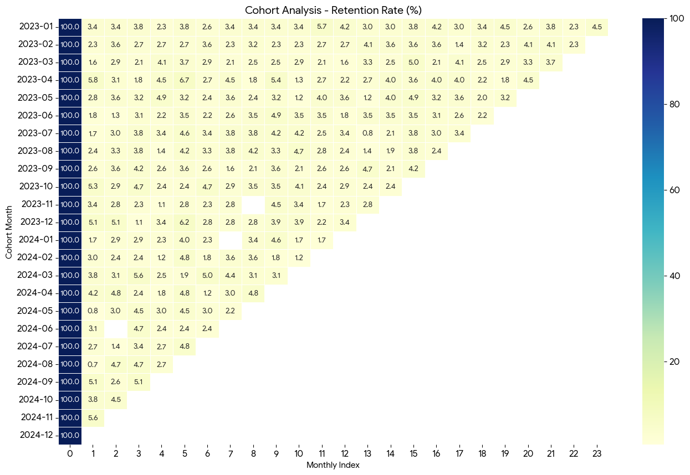
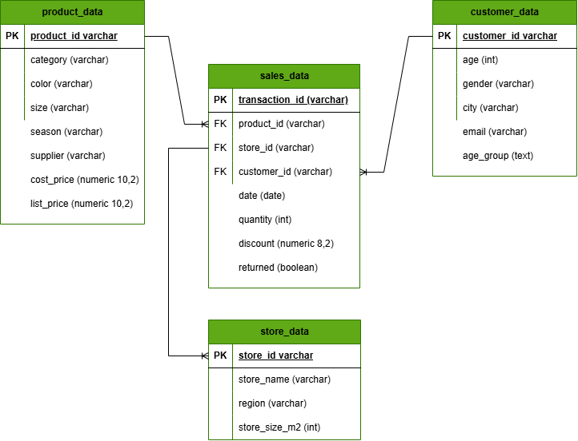
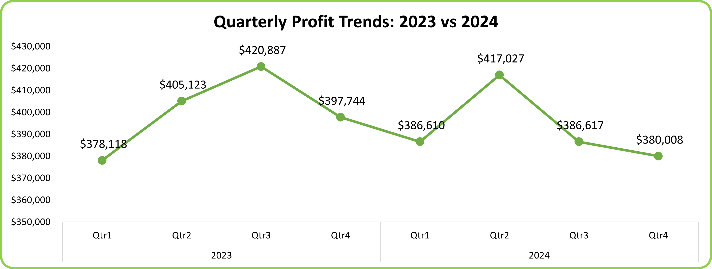
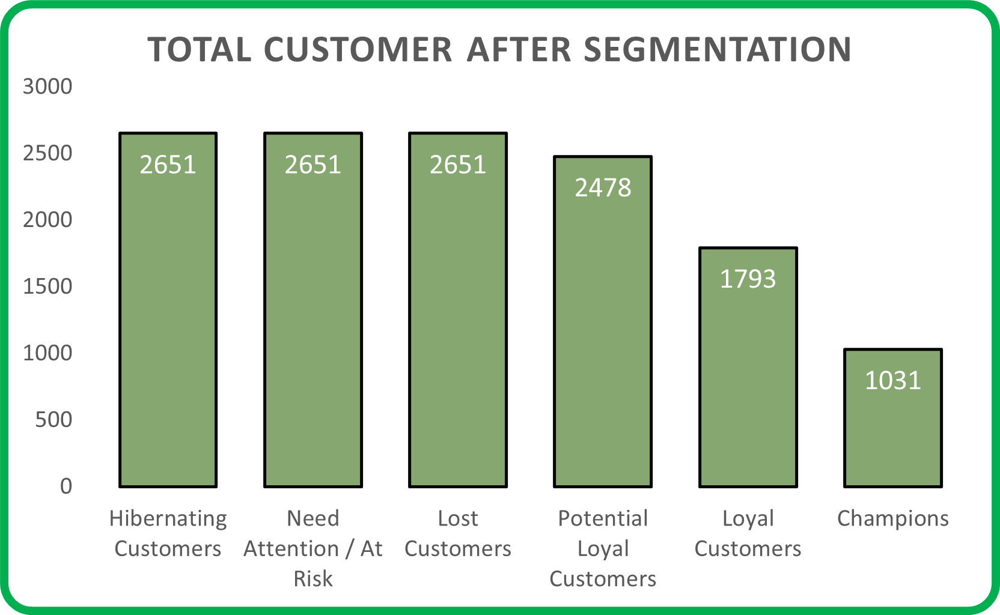
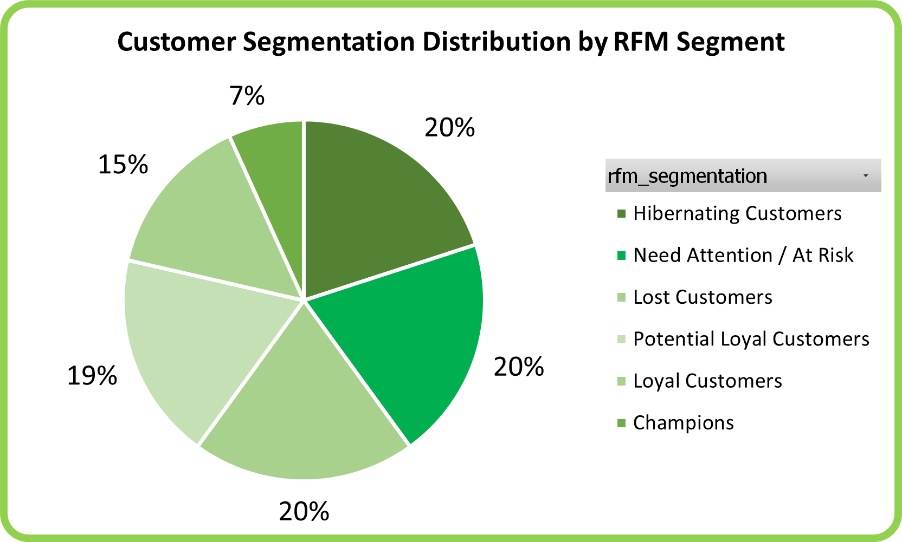
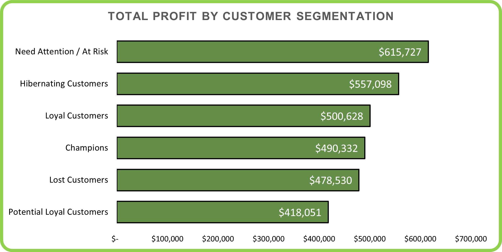
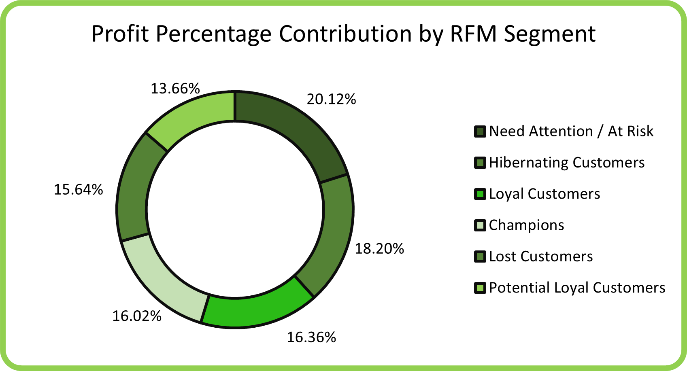

## Customer Segmentation with RFM Analysis and Retention Analysis (2023-2024)

<h2 align='Center' style="font-weight:bold; font-family:consolas">Project Overview</h2>

This project provides actionable business insights by combining <b>Cohort Retention Analysis</b> and <b>RFM Customer Segmentation</b> to understand both when customers churn and which customers are worth retaining.

This dataset cover retail fashion transactions from 2021-2024, but this analysis focuses on <b>2023-2024</b> to reflect current business conditions and provide relevant strategic recommendations

**Found the original dataset here**:
[Original Dataset](https://www.kaggle.com/datasets/vanpatangan/retail-fashion-data)

---

#### Business Question :

How is customer retention performing, which customer segments contribute most to profits during the 2023-2024 period?

To answer this comprehensively, we need to understande:
<ol>
   <li>When do customers leave ?</li>
   <li>Who are our most valuable customers</li>
   <li>Where should we focus retention efforts</li>
</ol>

---

<h2 style="font-family:consolas; font-size:1.2rem; font-weigh:bold">
Part one: Cohort Retention Analysis - to understanding WHEN Customer Churn
</h2>

**Key Findings**

1. **Extreme First-Month Chutn Across All Cohorts**
   - **95%** churn rate occurs immediately after the first purchase across nearly all cohorts from 2023-2024.
   - January 2023 cohort: 265 customers acquired, but only **3.4% returned** in month 2 (256 customers lost immediately).
   - This pattern is consistent regardless of acquisition period, indicating a **systematic retention problem rather than seasonal issues**.
2. **Acquisition Trends and Peak Performance Windows**
   **High performing acquisition periods:**
   - April 2023: **5.8%** retention in month 2 (highest in 2023)
   - November 2024 :**5.6%** retention in month 2 (highest in 2024)
   - Q4 months (Oct-Dec) consistenly show **~5% retention**, suggesting year-end campaigns have slightly better effectivenes
     **Declining acquisition volume:**
   - January 2023 : 265 new customers.
   - December 2024 : only **1 new customers**
   - Consistent downward trend throughout 2023-2024, indicating weakening acquisition channels
3. **Critical Low Points - Operationa Red Flags**
   **Worst Performing Cohorts:**
   - May 2024 : **0.75%/0.8%** retention (lowest in dataset)
   - August 2024 : **0.67%** retention
   - These Q2-Q3 2024 dips suggest potential operational issues, product quality problems, or market saturation during mid-year
4. **Quarterly Behavior Patterns**
   - **Q1 (Jan-Mar)** : Moderate acquisition, weak retention (~3-4%).
   - **Q2-Q3 (Apr-Sep)** : Highly variable, with both peaks (Apr 2023) and valleys (May-Aug 2024).
   - **Q4 (Oct-Dec)** : Smaller cohorts but relatively stronger retention (~5%), indicating better quality acquisition.

**Initial Conclusions from Cohort Analysis**
The cohort reveals **WHEN** the problems occurs (immediate post-purchase churn), but leaves critical questions un-answered:

- **Who are the 3-5% that DO return ?**
- **What makes them different from the 95% who churn ?**
- **Are these returning customers profitable enough to justify retention investment ?**
- **Should we focus on acquiring better customers or retaining existing ones ?**

---

**Before going to the RFM anlysis, i want you to see about the dataset below**

---

<h3 align='center' style="font-family:consolas">Dataset Structure and ERD (entity relationship Diagram)</h3>
Struktur table terdiri dari 4 tabel dimana sales_data menjadi star schema yang menghubungkan tabel lainnya yaitu: customer_data,product_data dan store_data dengan 3 tabel memiliki lebih dari 20.000 rows count, dan terdapa 5 rows count saja pada tabel store_data

---

---

<h2 align='center' style="font-family:consolas">Insights Deep Dive</h2>

<h2 style="font-weight:bold;text-align:center; font-family:consolas">
Part 2: Customer Segmentation Using RFM Analysis - Understanding WHO our valuable Customers Are
</h2>

### Why RFM Analysis Matters ?

Cohort analysis shows that **95% of customers never return after their first purchase**. However, it cannot answer:

- Which customers in that remaining 5% are actually driving profit ?
- Are we losing high-value customers or low-value ones ?
- Which segments should receive priority in retention campaigns ?

**RFM (Recency,Frequency,Monetary)** analysis sill segmenting customers based on behavioral pattersn to identify:

- **High-value customers** worth retaining _(Champions, Loyal)_
- **At-risk customers** who used to be valuable _(Need Attention)_
- **Lost Customers** who may be reactivatable _(Hibernating, Lost)_
- **Low-value customers** not worth retention investments

### RFM Methodology Summary

| Step             | Description                                                                                                             |
| ---------------- | ----------------------------------------------------------------------------------------------------------------------- |
| Data Integration | Sales, customer, product, and store tables are joined after data cleaning. Analysis period is limited to 2023–2024.     |
| Aggregation      | Transactions are aggregated at customer level to calculate Recency, Frequency, Monetary, and Average Order Value.       |
| Scoring          | RFM values are scored using quantile-based segmentation (NTILE 1–5), where higher scores indicate stronger performance. |
| RFM Cell         | RFM Cell is created by concatenating R, F, and M values (e.g., 555). Total RFM score is calculated by summation.        |
| Segmentation     | Customers are grouped into business segments such as Champions, Loyal, Potential Loyal, Hibernating, Lost, and At Risk. |

<h2 style="font-weight:bold">
Part 3: Combined Insights - Connecting Retention Patterns to customer Value
</h2>

<h3 align='center' style="font-family:consolas">Quaterly profit trends untuk 2023 sampai 2024</h3>

**Profit Patterns**

**2023 Performance:**

- Q1-Q3: steady growth from $368K -> $384K (+4.3%)
- Q4: Sharp drop to $365K (-5.5%)
- **Total 2023**: $1,451M

**2024 Performance:**

- Q1: Strong recovery to $351K (+3.9% from 2023 Q4)
- Q2-Q4: Continuous decline -> $352K -> $345K (-8.5% from Q1)
- **Total 2024**: $1,426M (-1.7% YoY)

**Connecting to Cohort Insights:**
When we overlay cohort data with profit trends:

1.  **Q4 profit drops align with cohort size decline** -> Fewer new customers = lower revenue potential.
2.  **Q1 profit spikes coincide with larger cohorts** -> Acquisition volume still drives short-term revenue.
3.  **Mid-year profit decline (Q3-Q3 2024) matches retention collapse** -> May-Aug 2024 cohorts had 0.67-0.75% retention and contributed minimal revenue.

**Key Insight**: The business is trappe in a **"Leaky Bucket"** model - constanly needing new customers because existing ones don't return, making revenue entirely dependent on acquisition volume.

 

Customer Distribution by RFM Segments

<table>
<tr>
<td width="50%">
<h4 align="center">Total Customer by RFM Segmentation</h4>

</td>
<td width="50%">
<h4 align="center">Customer Distribution by RFM Segmentation</h4>

</td>
</tr>
</table>

**Segment Breakdown** 

Connecting to Cohort Churn

The **60% concentration in Hibernate/At-Risk/Lost** segments directly validates the cohort finding that **95% of customers churn immediately**:

- Most customers make 1-2 purchases then disappear -> classified as "Hibernating" or "Lost".
- Very few into "Loyal" or "Champions" -> only 19% combined.
- The small Champion segment (~6.6%) represent the 3-5% who actually return in cohort analysis
**This Confirm:** The cohort churn pattern is not just about _timing_ - it's about fundamental customer behavior where the majority are **one-time buyers**

<h2 align="center" style="font-weight:bold;font-family:consolas">Profit Distribution by RFM Segments</h2>
<table>
<tr>
<td width="50%">
<h4 align="center">Total Profit by RFM Segmentation</h4>

</td>
<td width="50%">
<h4 align="center">Profit distribution for RFM Segmentation</h4>

</td>
</tr>
</table>

**Business Insight** 
**The Retention Paradox**: 

1.  **Champions (6.6% Customers) generate 16% of profit** 
    - High customers lifetime value, but we're failing to create more Champions (cohort analysis shows 95% churn).
2.  **At-Risk + Hibernating + Lost (60% of customers) generate 54% of profit** 
    - The business is heavily dependent on customers who already churning or inactive
    - This explains why profit is declining in 2024 - we're losing the customers who drive revenue
3.  **Profit concentration in declining segments = unsustainable model** 
    - As cohort size shrink (265 -> 1 customers) and retention stays at 3-5%, the pool of "at risk" and "hibernating" customers will eventually run dry.
4.  **Game-Changing Insight: Loyal Customers are Undervalued** 
    - Loyal customers (16.08% of profit) match Champions (16.17%) in total contribution.
    - With 1,935 Loyal vs 880 Champions, Loyal segment has 2.2x more growth potential.
    - Increasing Loyal customer spending by just 25% would make them the #1 profit contributor.
    - Strategy shift: Focus on Loyal → Champion conversion, not just creating Champions from scratch

**After all of this,do you think will answers our cohort question: "Are the 3-5% who return valuable enough to retain ?"** 
**Answer: YES**. Those who become Champions deliver 2.4x more profit per customer than the average. The problem is we create too few of them.

<h2 align="center" style='font-weigh:bold;font-family:consolas'>Integrated Strategic Recommendations</h2>

**1.Fix the first-month experience (Address 95% churn)**

**Problem**: Cohort analysis shows catastrophic drop-off after first purchase.

**Root Cause**: RFM shows 60% become hibernating/at risk/lost, indicating no engangement post-purchase.

**Action**:

- Implement 30-60-90 day onboarding program for new customers
- Trigger personalized follow-ups within 7 days of first purchase
- Offers 'second purchase incentive' within 14 days (data shows most churn happens in month 1)
- Survey first-time buyers to identify friction points 

**2. Protect and Grow Champions (16% of profit from 6.6% Customers)**

**Problem**: Too few customers develop into champions despite their high value

**Opportunity**: Champions are 2.4x more profitable per customer

**Actions**:

- Create **VIP loyalty program** exclusive to champion and loyal customers
- Offer early access to new products, exclusive discounts, or personalized styling
- Assign didcated account management for top 880 champions.
- Analyze purchase pattern of Champions vs one-time buyers to indetify 'Champions indicators' 

**3. Reactivate At-Risk and Hibernating Customers (54% of profit)** 
**Problem**: Over half of profit comes from customers who already disengaging/ 
**Urgency**: As cohort size shrink, this revenue source will evaporate 
**Actions**:

- **Win-back champions** for hibernating customers (personalized 'we miss you' offers)
- **Re-engagement program** for At-Risk customers (exclusive discounts,new product launches)
- **Segment by past purchase category** send targeted product recommendations
- Focus reactivations on customers with previous AOV > $100 (higher ROI potential) 

**4.Optimize Acquisition Strategy (Address Declining Cohort Size)**

**Problem**: New customers acquisition dropped from 265 (Jan 2023) to 1 (Dec 2024).

**Insight**: RFM shows most acquired customers become one-time buyers anyway

**Strategic Shift**: Quality over Quantity

- **Stop mass acquisition campaigns** they create hibernating customers, not champions
- **Focus on targeted acquisition** of customers who match champion profiles:
  - Higher income demographics
  - Fashion enthusiast (social media engagement)
  - Previous brand references indicators
- **Analyze Q4 Cohorts** (Oct-Dec) which show 5% retention vs 3% average - replicate what works 

**5. Address Q2-Q3 Seasonal Weakness**

**Problem**:

- Cohort analysis: May-Aug 2024 had worst retention (0.67-0.75%)
- Profit analysis: Q2-Q3 2024 saw continuous decline.
- 
  **Actions**:
- Investigate **operational issues during mid-year** (shipping delays, stock-outs, quality problems)
- Launch **seasonal campaigns in Q2-Q3** to counteract historical weakness
- Replicate Q2 2023 success (which had strong profit growth)-analyze what worked
- Consider mid-year loyalty events (summer sales, exclusive previews) to boost engagement.

**6. Laverage Q4 Acquisition Strength**

**Problem**: Q4 shows better retention (~5%) but profit still drops

**Opportunity**: Customers acquired in Q4 have higher quality

**Actions**:

- Double down on Q4 marketing - allocate 40% of annual acquisition budged here
- Analyze what makes Q4 customers different (holiday shoppers vs brand loyalist)
- Extend Q4 engagement into Q1 with 'New Year refresh' campaigns
- Track Q4 cohorts into 2025 to see if 5% retention sustains 

---

**Conclusion** 
By connectiong when customers leave (Cohort Analysis) with who is valuable (RFM Analysis), we've uncovered that:

- The 3-5% who return become our most profitable customers (Champions)
- The 95% who churn immediately drag down overall profitability
- 54% of current profit comes from customers who are already disengaging
- Without intervention, shrinking cohorts + poor retention = continued profit decline

**The path forward is clear**: Transform from a transactional business to a relationship-driven model, where customer retention becomes they primary driver of growth

## Tech Stack

| Technology      | Purpose                                                                          |
| --------------- | -------------------------------------------------------------------------------- |
| PostgreSQL      | Database management and data storage                                             |
| DBeaver         | Database administration and SQL query execution for data cleaning and validating |
| VS Code         | Code editor for SQL scripts and documentation                                    |
| Microsoft Excel | Deck and Dashboard                                                               |
| Power BI        | Data visualization and interactive dashboards                                    |
